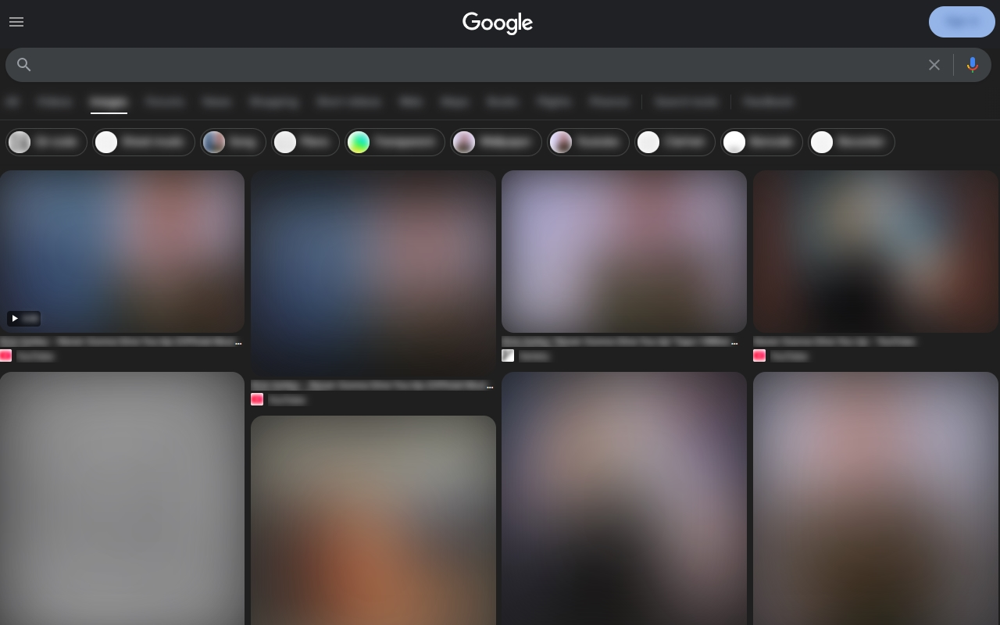
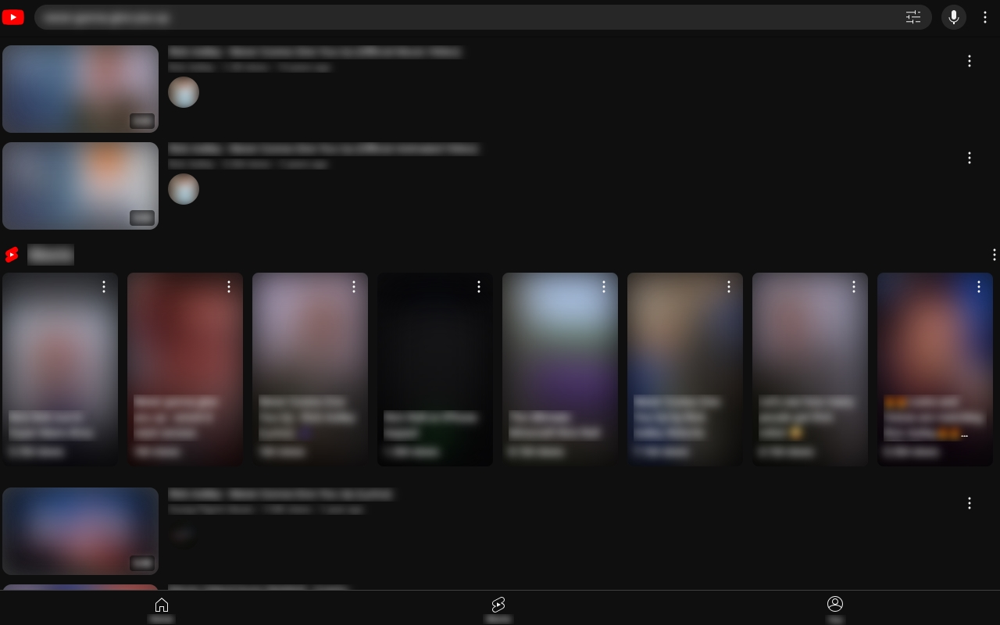
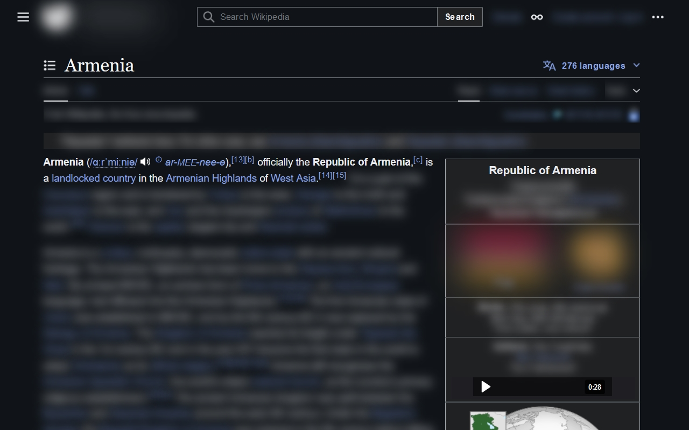

# Blur

> Blur any highlighted text or media on a page.

Examples:

(Limitations) This extension can't blur:

- SVG icons
- Background images
- Text inputs
- Anything that can't be highlighted

## Installation

- [Firefox](TODO:)
- [Chrome](TODO:)

## Usage

1. Highlight text and/or media elements anywhere on a web page.
2. Right-click the page to open your browser's context menu.
3. Click the `Blur` option to blur the selected content.

You can control the blur intensity from the extension pop-up menu.

## Local Development Setup

In both Chrome and Firefox, you can load extensions that are being locally developed.

1. Clone the repo.
2. Run `corepack enable` to enable Corepack.
3. Run `corepack install` to install pnpm.
4. Run `pnpm install` to install dependencies.
5. Run `pnpm build` to generate the `dist/` directory.
6. Choose this directory in your browser's extension manager (e.g., "Load unpacked" in Chrome).

## Feature Planning

Nice-to-haves:
- [ ] Sync to profile rather than local