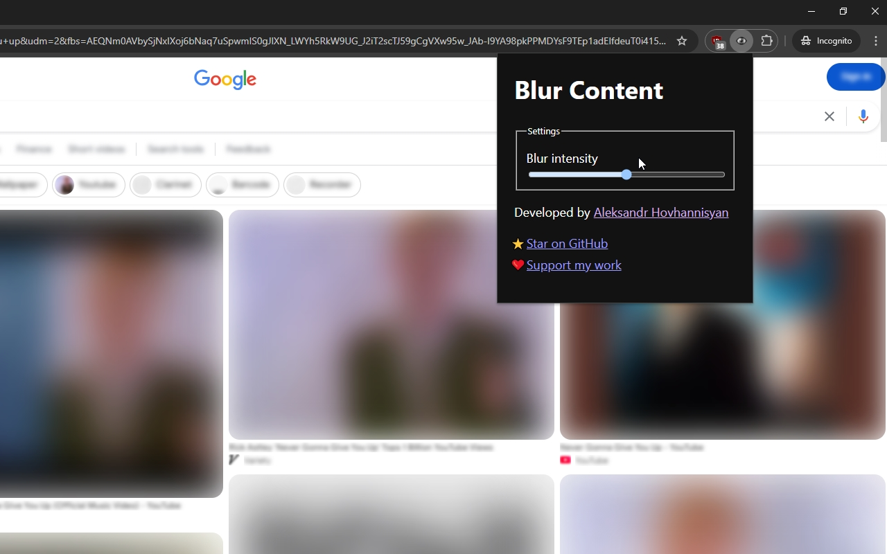

# Blur Content

> A browser extension to blur highlighted text and media anywhere on a page.

## Compatibility

Compatible with:

- Firefox
- Chrome

## Usage

1. Highlight text and/or media elements anywhere on a web page.
2. Right-click the page to open your browser's context menu.
3. Click the `Blur` option to blur the selected content.

You can control the blur intensity from the extension pop-up menu.

## Feature Planning

Nice-to-haves:
- [ ] Sync to profile rather than local