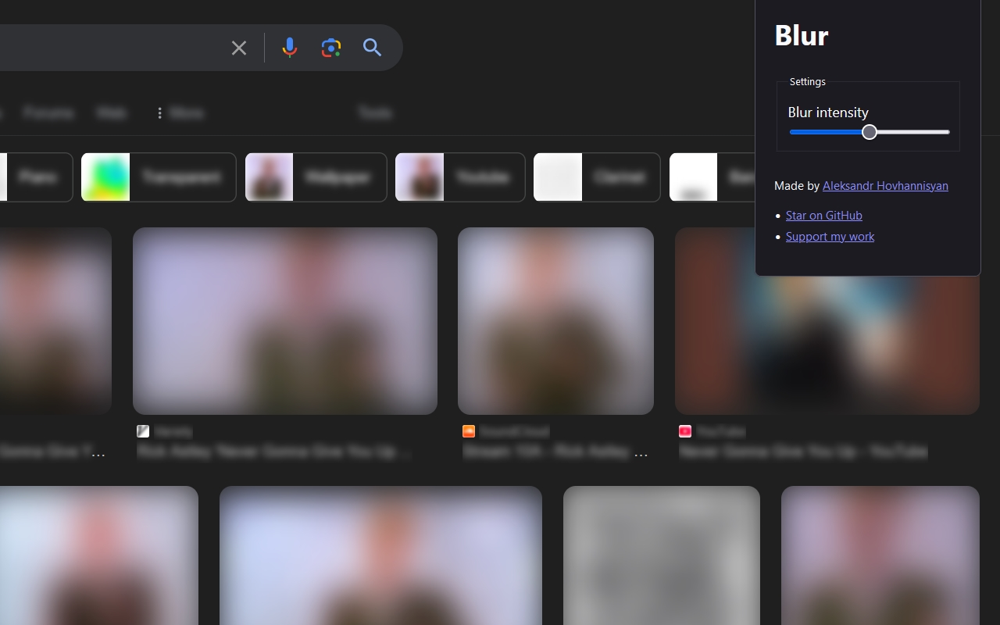

# Blur

> Blur any highlighted text or media on a page.

## Installation

- [Firefox](TODO:)
- [Chrome](TODO:)

## Examples

(Limitations) This extension can't blur:

- SVG icons
- Background images
- Text inputs
- Anything that can't be highlighted

## Usage

1. Highlight text and/or media elements anywhere on a web page.
2. Right-click the page to open your browser's context menu.
3. Click the `Blur` option to blur the selected content.

You can control the blur intensity from the extension pop-up menu.

## Local Development Setup

Prerequisites:
- Node >= 18

Steps:
1. Clone this repository.
2. Run `corepack enable` to enable Corepack.
3. Run `corepack install` to install pnpm, the package manager for this project.
4. Run `pnpm install` to install dependencies.
5. Run `pnpm build` to generate `dist/chrome` and `dist/firefox`.
6. Choose the right directory in your browser's extension manager
    - Chrome: Go to `chrome://extensions/` and click `Load unpacked`
    - Firefox: Go to `about:debugging#/runtime/this-firefox` and click `Load Temporary Add-on...`

## Feature Planning

Nice-to-haves:
- [ ] Sync to profile rather than local